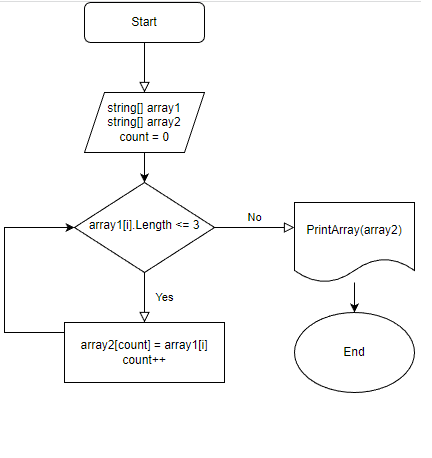

# Задача:

**Написать программу , которая из имеющегося массива строк формирует массив из строк, длина которых, меньше либо равна 3 символам.**

# Алгоритм

* Объявить 2 массива: `(string [] array1)` и `(string [] array2)` одиннаковой длины. 
* Вывести первый массив на экран.
* Дальше создем метод `(void SecondArray)`, который проверяет циклом условие (что длина элемента массива `(<= 3)`)
* Дальше создаем метод `(void PrintArray)` вывода массива `(string[] array2)`, где цикл проходит по длине массива и выписывает элементы массива.
* Дальше обращаемся к методу `(SecondArray)`, чтобы приступить к выполнению условия.
* Обращаемся к методу `(PrintArray)` вывести `(string[] array2)` на экран.

# Блок - схема алгоритма.

